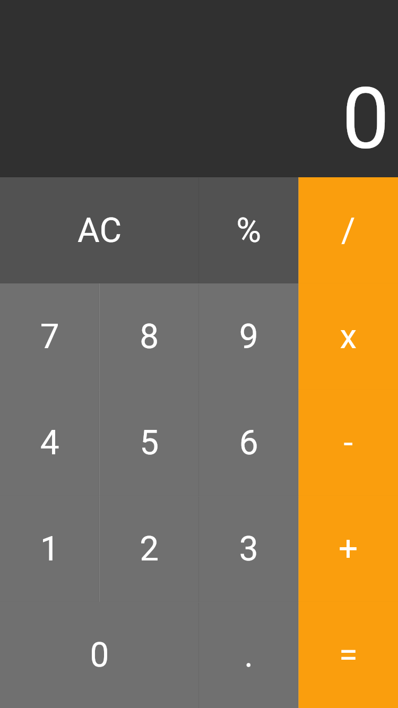
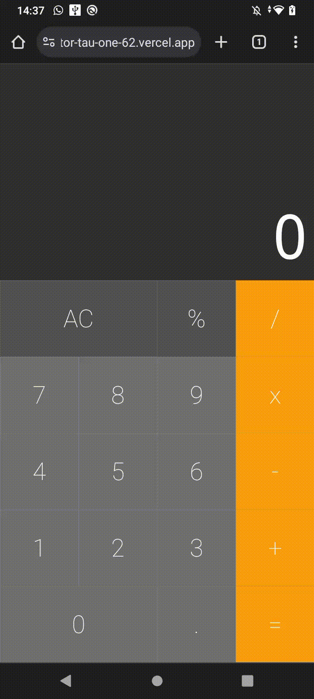

# calculator

A simple calculator

## Installation

Make sure you have Flutter installed on your machine. If you don't already have it, you can [install Flutter](https://flutter.dev/docs/get-started/install).

Clone this repository:

```bash
git clone https://github.com/tiagors09/calculator.git
```

Then go to the project directory:

```bash
cd calculator
```

Install dependencies:

```bash
flutter pub get
```

## Running the Application

Make sure a device (emulator or physical device) is connected and ready.

Run the application:

```bash
flutter run
```

## Screenshots




